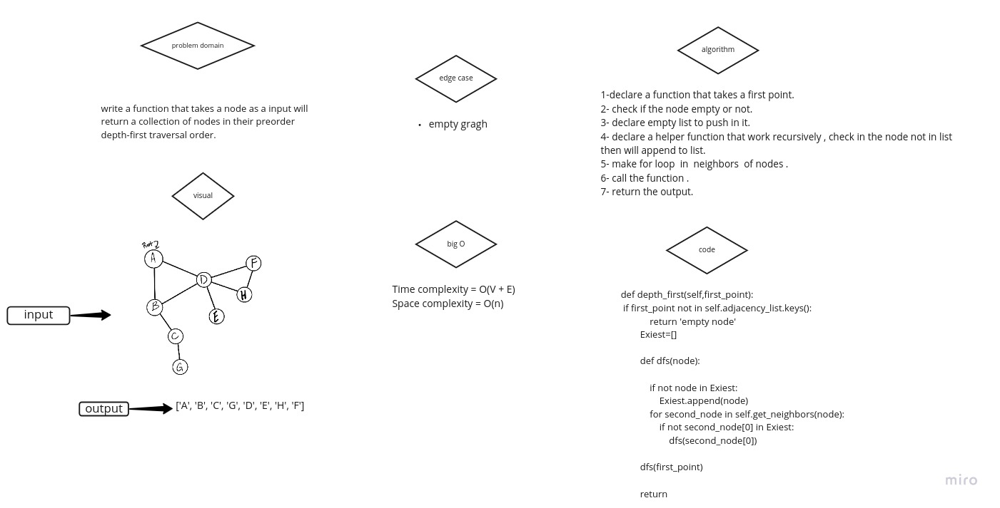

# Challenge Summary
Depth First Traversal (or Search) for a graph is similar to Depth First Traversal of a tree. The only catch here is, unlike trees, graphs may contain cycles, a node may be visited twice. To avoid processing a node more than once, use a boolean visited array.

## Whiteboard Process

## Approach & Efficiency
Time complexity = O(V + E)

Space complexity = O(n)

