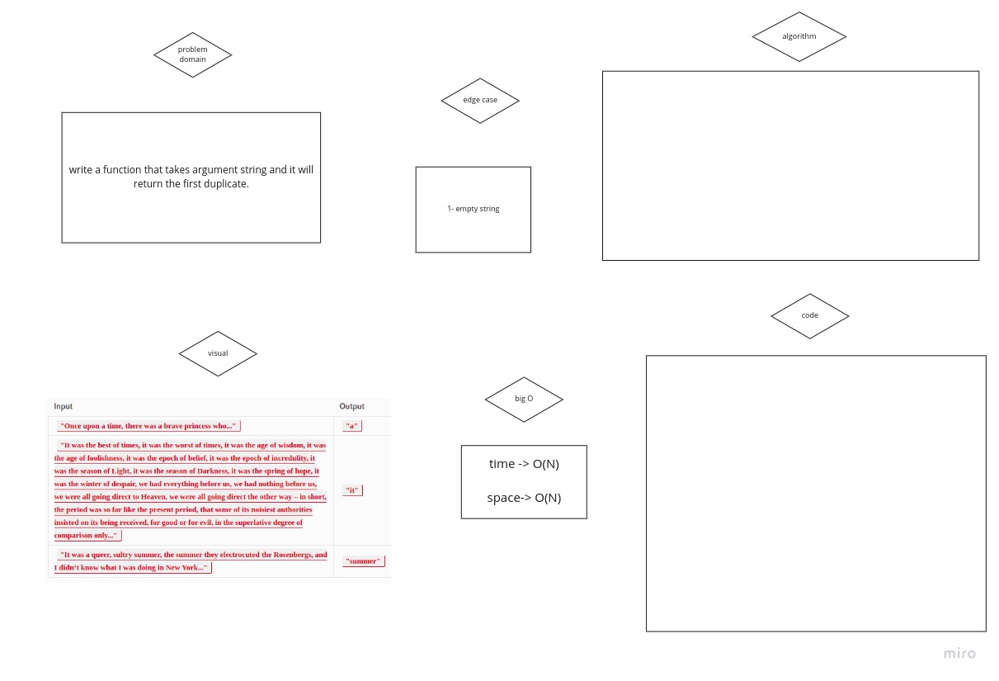

# Hashtables
 is a data structure that implements an associative array abstract data type, a structure that can map keys to values. A hash table uses a hash function to compute an index, also called a hash code, into an array of buckets or slots, from which the desired value can be found.

## Challenge
Code Challenge: Class 30: Hash Table Implementation

code challenge 31:(hashmap-repeated-word)

## Author
Ahmad abudames

## PR
https://github.com/ahmadabudames/data-structures-and-algorithms/pull/22

