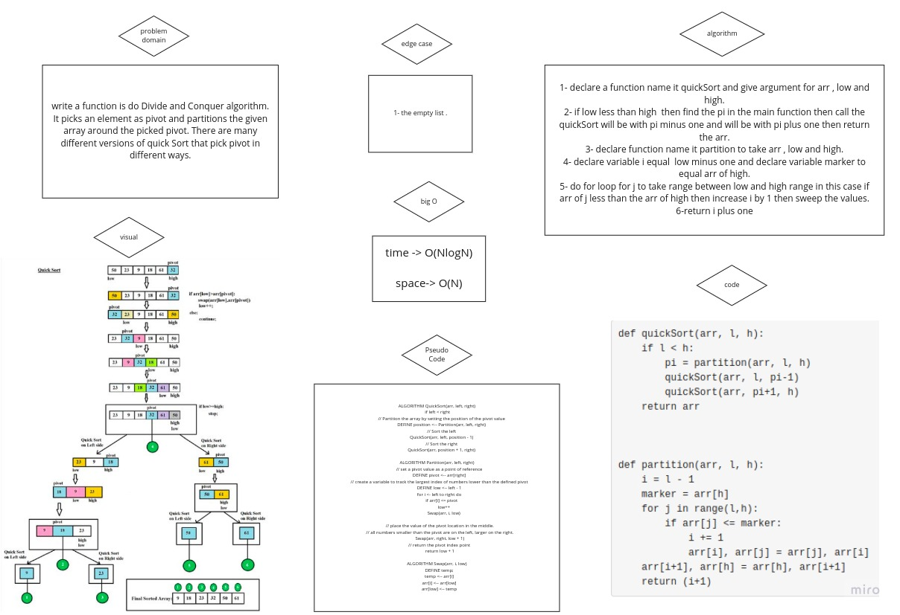

# Challenge Summary

QuickSort is a Divide and Conquer algorithm. It picks an element as pivot and partitions the given array around the picked pivot. There are many different versions of quickSort that pick pivot in different ways.

## Whiteboard Process

## with who I worked

I worked with khaled al shishani
